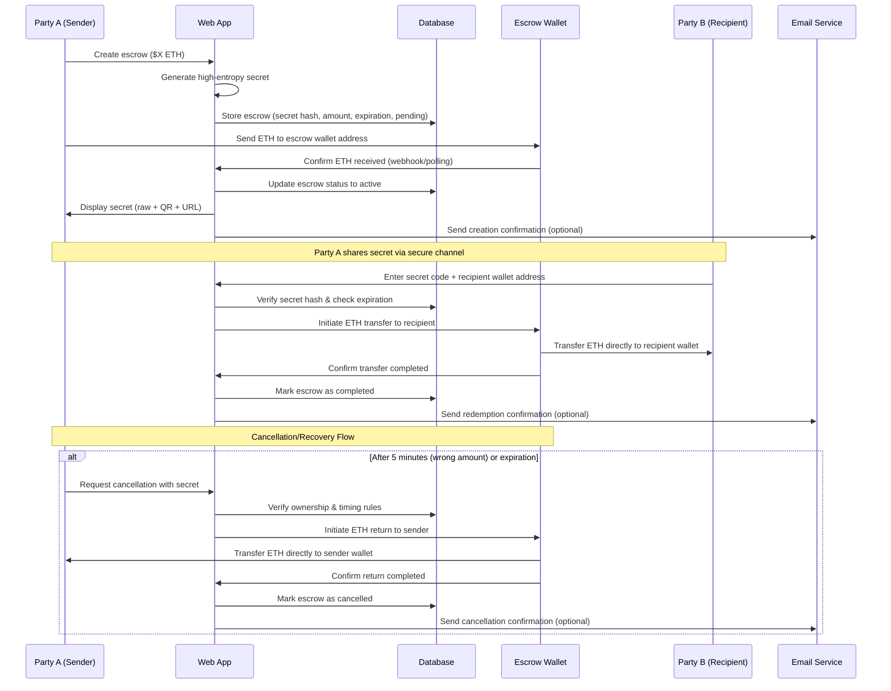

# 🎁 Coin Gift - Crypto Escrow Gift Application

Send crypto gifts to friends and family using shareable secret codes. Recipients don't need wallets - just enter the code to claim their gift.

## 🎯 How it Works

1. **Create Gift**: Send ETH to escrow, get a secret code
2. **Share**: Send the code/QR/link to recipient  
3. **Claim**: Recipient enters code + their wallet address to receive ETH

**Stack**: React + Hono + Cloudflare (Workers/Pages/D1)  
**Network**: Base (low fees)  
**Limits**: $1-$1000 for POC

## 🔄 Detailed Application Flow

## ✨ Features

- 🔐 Secure escrow with secret codes
- 📱 QR codes and mobile-friendly
- ⏰ 30-day expiration (sender recoverable)
- 🚀 No wallet needed for recipients

## 🏗️ Tech Stack

**Monorepo Structure:**
- `client/` - React + TypeScript + Vite 
- `server/` - Hono API on Cloudflare Workers
- `shared/` - Common types and utilities

**Infrastructure:**
- Frontend: Cloudflare Pages
- Backend: Cloudflare Workers  
- Database: Cloudflare D1 (SQLite)
- Package Manager: Bun

**Why Cloudflare:** Simple, cheap (free tier), single platform for everything.

## 🚀 Development Plan

**Phase 1: MVP**
- [ ] Monorepo setup with Bun
- [ ] Hono API + D1 database  
- [ ] React frontend with routing
- [ ] Secret generation + QR codes
- [ ] Create/redeem flow
- [ ] MetaMask integration
- [ ] Deploy to Cloudflare

**Phase 2: Smart Contracts (Maybe)**
- [ ] Move escrow logic on-chain
- [ ] Trustless operation

## 🔒 Security Notes

- High-entropy secrets (32+ chars)
- Secrets hashed in database
- Rate limiting on API
- 30-day expiration with recovery
- HTTPS everywhere