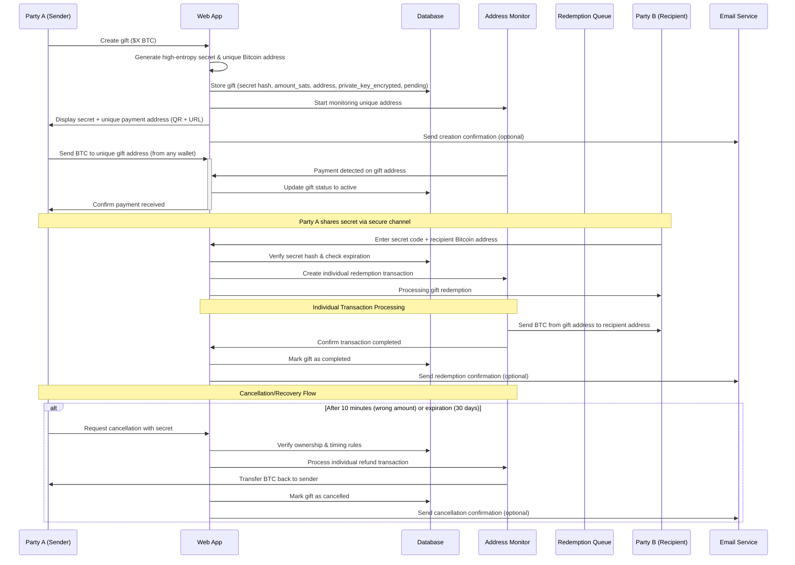

# 🎁 Coin Gift - Bitcoin Escrow Gift Application

Send Bitcoin gifts to friends and family using shareable secret codes. Recipients don't need wallets - just enter the code to claim their Bitcoin.

## 🎯 How it Works

1. **Create Gift**: Send BTC to escrow, get a secret code
2. **Share**: Send the code/QR/link to recipient  
3. **Claim**: Recipient enters code + their Bitcoin address to receive BTC

**Stack**: React + Hono + Cloudflare (Workers/Pages/D1)  
**Network**: Bitcoin Mainnet (with future Lightning Network support)  
**Limits**: $5-$1000 for MVP

## 🔄 Detailed Application Flow

## ✨ Features

- 🔐 Secure Bitcoin storage with secret codes
- 📱 QR codes and mobile-friendly
- ⚡ Unique address per gift for reliable payments
- ⏰ 30-day expiration (sender recoverable)
- 🚀 No Bitcoin wallet needed for recipients initially
- 🔮 Future: Lightning Network support for instant micro-gifts

## 🏗️ Tech Stack

**Monorepo Structure:**
- `client/` - React + TypeScript + Vite 
- `server/` - Hono API on Cloudflare Workers
- `shared/` - Common types and utilities

**Infrastructure:**
- Frontend: Cloudflare Pages
- Backend: Cloudflare Workers  
- Database: Cloudflare D1 (SQLite)
- Bitcoin: Unique address per gift for reliable payment tracking
- Address Monitoring: Electrum servers / BlockCypher API
- Package Manager: Bun

**Bitcoin Libraries:**
- bitcoinjs-lib: Transaction building and signing
- Electrum API: Blockchain monitoring and fee estimation
- Future: Lightning Network integration (WebLN/BTCPay Server)

**Why Cloudflare:** Simple, cheap (free tier), single platform for everything.

## 🚀 Development Plan

**Phase 1: Bitcoin Mainnet MVP**
- [ ] Monorepo setup with Bun ✅
- [ ] Hono API + D1 database with Bitcoin schemas
- [ ] React frontend with Bitcoin theming
- [ ] Secret generation + QR codes
- [ ] Bitcoin gift creation flow with unique addresses
- [ ] Address generation and monitoring system
- [ ] Individual gift redemption system
- [ ] Bitcoin wallet integration (external wallet support)
- [ ] Blockchain monitoring via Electrum/BlockCypher APIs
- [ ] Private key management and encryption
- [ ] Fee optimization & UTXO management
- [ ] Deploy to Cloudflare

**Phase 2: Lightning Network Integration**
- [ ] Lightning Service Provider (LSP) integration
- [ ] WebLN browser wallet support
- [ ] Instant redemption option
- [ ] Lightning/Mainnet routing logic
- [ ] Mobile wallet deep linking

**Phase 3: Advanced Features**
- [ ] Multi-signature security
- [ ] Gift scheduling
- [ ] Bulk gift creation
- [ ] Advanced analytics

## 🔒 Security Notes

- High-entropy secrets (32+ chars)
- Secrets hashed in database (SHA-256)
- Rate limiting on API endpoints
- 30-day expiration with sender recovery
- Unique address per gift eliminates payment confusion
- Private keys encrypted at rest (AES-256)
- Individual transactions reduce complexity and improve reliability
- Address monitoring via trusted third-party APIs
- HTTPS everywhere
- Future: Hardware wallet integration for escrow

## 💰 Fee Structure & Economics

**Mainnet Individual Transaction Approach:**
- Platform Fee: 1.5% (competitive with gift card services)
- Network Fees: Standard Bitcoin transaction fees (~$1-15 depending on network congestion)
- Total Cost: ~3-8% for gifts $25+ (simplified, reliable processing)

**Lightning Network (Future):**
- Platform Fee: 1% (lower due to reduced operational costs)
- Network Fees: <$0.01 per transaction
- Total Cost: ~1.1% (perfect for micro-gifts $1-20)

**Gift Amount Recommendations:**
- $5-25: Wait for Lightning integration (high fee ratio on mainnet)
- $25+: Good for mainnet with individual transactions
- $100+: Excellent value proposition vs traditional methods