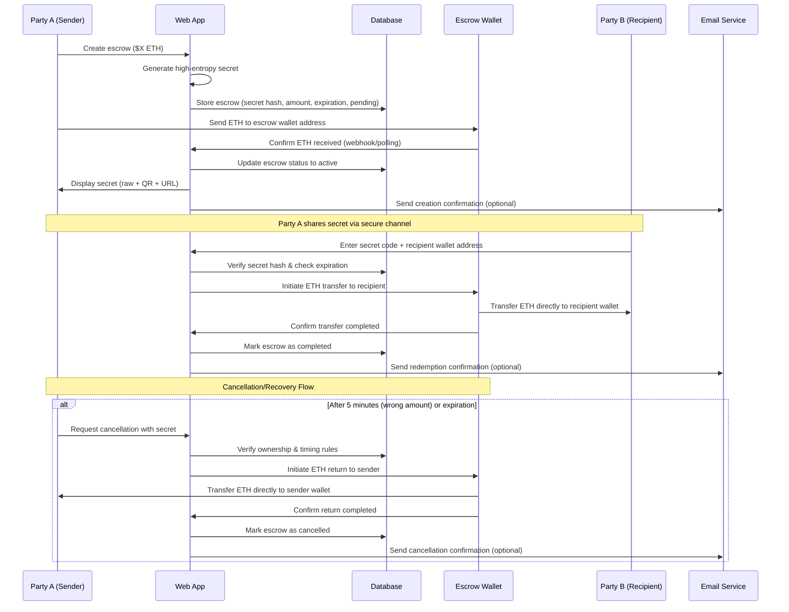

# 🎁 Coin Gift - Crypto Escrow Gift Application

A simple a## 🏗️ Technical Architecture

### Monorepo Structure
- **Client**: React frontend with Vite
- **Server**: Hono API on Cloudflare Workers
- **Shared**: Common types and utilities
- **Package Manager**: Bun

### Frontend (`/client`)
- **Framework**: React with TypeScript
- **Build Tool**: Vite
- **Routing**: TanStack Router
- **Deployment**: Cloudflare Pages
- **Wallet Integration**: MetaMask for senders
- **UI/UX**: Simple responsive design

### Backend (`/server`)
- **Framework**: Hono
- **Runtime**: Cloudflare Workers
- **Database**: Cloudflare D1 (SQLite)
- **Deployment**: Cloudflare Workers
- **Wallet Management**: Single escrow wallet

### Supporting Services
- **Email Service**: Basic email notifications (optional)
- **Rate Limiting**: Simple API rate limiting
- **Monitoring**: Basic Cloudflare Analyticsi## 💡 Key Design Decisions

### Secret Generation
- **Format**: High-entropy random string (32+ characters)
- **Encoding**: Base64/Base58 for URL safety
- **Sharing**: Direct URL links and QR codes
- **Security**: Hashed in database, never stored in plaintext

### Economic Model
- **Escrow Limits**: $1 minimum, $1000 maximum (POC)
- **Transaction Fees**: Sender covers Base network fees
- **Operational Costs**: Covered by optional donations
- **Recovery**: Wrong amounts recoverable after 5 minutes

### Security Features
- **Wallet Security**: Multi-sig or hardware wallet for escrow funds
- **Rate Limiting**: API-level protection against brute-force attacks
- **Expiration**: Default 30-day expiration with sender recovery
- **Audit Trail**: Complete database logging for transparency
- **HTTPS**: Secure communication protocols
- **Data Encryption**: Sensitive data encrypted at resto friends and family. This application serves as a temporary escrow for crypto transactions, allowing users to send crypto gifts that recipients can claim using a secret code.

## 🎯 Overview

**Target Use Case**: Send crypto gifts for birthdays, holidays, or special occasions  
**Architecture**: Backend Service with Escrow Wallet  
**Supported Assets**: ETH on Base (POC)  
**License**: Open Source  

## ✨ Key Features

- 🔐 **Secure Escrow**: Backend service with dedicated escrow wallet
- 🎲 **High-Entropy Secrets**: URL/QR-shareable secret codes
- ⏰ **Configurable Expiration**: Default 30 days, sender recoverable
- 💰 **Amount Limits**: $1 - $1000 (POC)
- 📧 **Email Notifications**: Optional alerts for all parties
- 🚀 **Simple UX**: No wallet required for recipients
- 📱 **Mobile-Friendly**: QR codes and responsive design

## 🔄 Application Flow

## 🏗️ Technical Architecture

### Shared (`/shared`)
- **Types**: Common TypeScript interfaces
- **Utilities**: Shared helper functions
- **Validation**: Basic input validation

### Why Cloudflare Stack
- **Simple**: Single platform for everything
- **Cost Effective**: Free tier for pet projects
- **Easy Deployment**: Simple CI/CD integration

## 💡 Key Design Decisions

### Secret Generation
- **Format**: High-entropy random string (32+ characters)
- **Encoding**: Base58 for URL safety
- **Sharing**: Direct URL links and QR codes
- **Security**: Hashed on-chain, never stored in plaintext

### Economic Model
- **Escrow Limits**: $1 minimum, $1000 maximum (POC)
- **Gas Coverage**: Paymaster covers transaction fees
- **Donations**: Optional contributions to support the platform
- **Recovery**: Wrong amounts recoverable after 5 minutes

### Security Features
- **Rate Limiting**: Prevent brute-force secret attempts
- **Expiration**: Default 30-day expiration with sender recovery
- **Audit Trail**: Transaction logging for transparency
- **HTTPS**: Secure communication protocols

## 🚀 Implementation Phases

### Phase 1: Simple POC
**Goal**: Basic working gift escrow application

- [ ] Monorepo setup (client/server/shared)
- [ ] Hono API with D1 database
- [ ] React frontend with basic routing
- [ ] Shared types package
- [ ] Secret generation and QR codes
- [ ] Create/redeem flow
- [ ] Deploy to Cloudflare
- [ ] MetaMask integration
- [ ] Basic responsive design

**Simple approach**:
- Single escrow wallet managed by backend
- SQLite database for state
- No complex caching or optimization
- Focus on core functionality

### Phase 2: Smart Contract Version (Future)
**Goal**: Decentralized escrow on Base network

- [ ] Simple escrow smart contract
- [ ] On-chain secret verification
- [ ] Update frontend for contract interaction
- [ ] Basic multi-wallet support

**If there's demand**:
- Move escrow logic to smart contracts
- Trustless operation
- Keep the same simple UX

## 🔒 Security Considerations

- **Secret Complexity**: High-entropy generation prevents brute-force attacks
- **Rate Limiting**: API-level protection against automated attacks
- **Wallet Security**: Multi-sig or hardware wallet for escrow funds
- **Database Security**: Encrypted sensitive data and secure access controls
- **Communication Security**: HTTPS for all data transmission
- **Audit Trail**: Complete database logging for transparency
- **Time-based Recovery**: Sender can recover funds after expiration or error correction period
- **Custodial Risk Mitigation**: Regular security audits and monitoring

## 📊 Simple Architecture

**Target**: Small-scale pet project (~10-100 escrows)  
**Database**: Simple SQLite database (Cloudflare D1)  
**Blockchain**: Base network for low fees  
**Wallet Management**: Single escrow wallet  
**Monitoring**: Basic usage tracking  

## 🔄 Future Evolution

1. **Phase 1**: Simple backend escrow service
2. **Phase 2**: Smart contract implementation

Keep it simple initially, then add complexity only if needed.