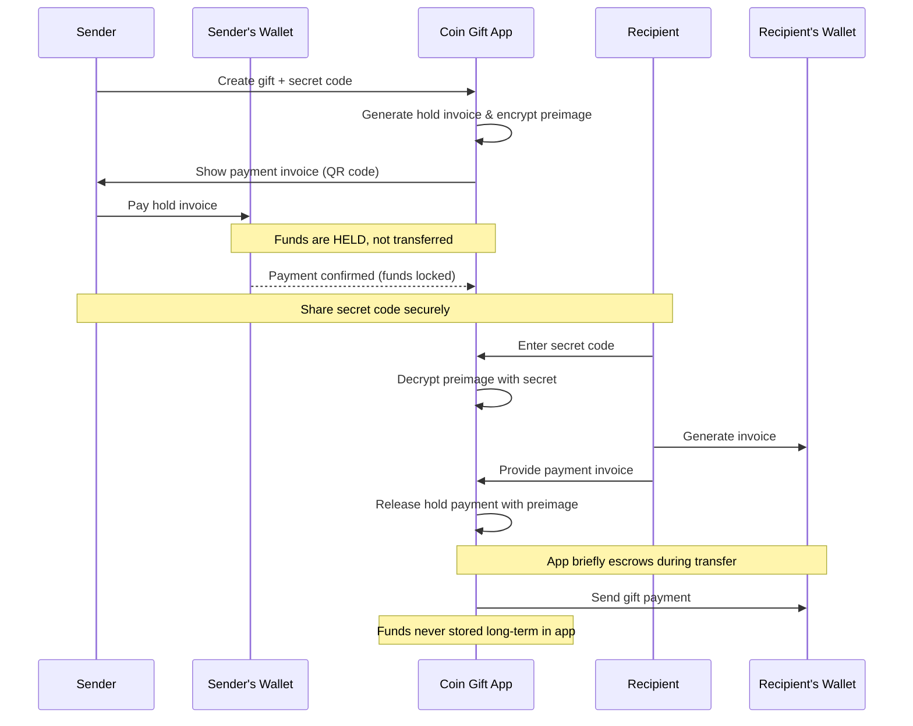

# 🎁 Coin Gift - Bitcoin Gift Application

Send Bitcoin gifts to friends and family using shareable secret codes. Recipients can claim instantly to any Lightning wallet using Nostr Wallet Connect.

## 🎯 How it Works

1. **Create Gift**: Generate [hold invoice](https://bitcoinops.org/en/topics/hold-invoices/), get a secret code
2. **Share**: Send the code/QR/link to recipient
3. **Claim**: Recipient enters code and claims Bitcoin instantly

**Stack**: React + Hono + Traditional Server Deployment + Alby SDK  
**Network**: Lightning Network (with future Bitcoin mainnet support for only larger amounts)  
**Limits**: $1-$100 to keep it fun and safe

## 🔄 Detailed Application Flow

## ✨ Features

- ⚡ Lightning Network for instant settlements
- 🔐 Hold invoice security - funds stay in sender's wallet until claimed
- � Encrypted preimage storage - only recipient's secret can release funds
- �📱 QR codes and mobile-friendly interface
- 🔗 Nostr Wallet Connect integration for seamless wallet connections
- ⏰ 30-day default expiration (user configurable) with automatic fund release
- 🎁 Batch gifting support for multiple recipients
- 🚀 Recipients need any Lightning wallet (WebLN supported)
- 🆓 Completely free - optional donations welcome
- 🔮 Future: Bitcoin mainnet support for larger amounts ($100+)

## 🏗️ Tech Stack

**Monorepo Structure:**

- `client/` - React + TypeScript + Vite
- `server/` - Hono API on Cloudflare Workers
- `shared/` - Common types and utilities

**Infrastructure:**

- Frontend: Static hosting
- Backend: Traditional server deployment (considering Fly.io, Railway, or similar)
- Database: SQLite
- Lightning: Alby SDK for hold invoices and settlements
- Wallet Connect: Nostr Wallet Connect (NWC) protocol
- Package Manager: Bun

**Lightning Libraries:**

- Alby SDK: Hold invoice creation and Lightning payments
- Nostr Wallet Connect: Wallet integration protocol
- WebLN: Browser-based Lightning wallet support
- Future: bitcoinjs-lib for mainnet Bitcoin integration

**Why This Stack:**

- **Traditional Server**: Full control, persistent connections, long-running processes
- **Lightning Network**: Instant settlements, micro-transaction friendly
- **Hold Invoices**: Superior security - funds never leave sender's wallet until claimed
- **Alby SDK**: Mature Lightning infrastructure with excellent developer experience
- **Flexible Deployment**: Can choose optimal hosting platform

## 🚀 Development Plan

**Phase 1: Lightning Network MVP**

- [ ] Monorepo setup with Bun ✅
- [ ] Hono API + D1 database with Lightning schemas
- [ ] React frontend with Lightning theming
- [ ] Secret generation + QR codes
- [ ] Alby SDK integration for hold invoices
- [ ] Nostr Wallet Connect (NWC) integration
- [ ] Lightning gift creation and redemption flow
- [ ] WebLN browser wallet support
- [ ] Batch gifting functionality
- [ ] Hold invoice security implementation
- [ ] Mobile wallet deep linking
- [ ] Deploy to chosen hosting platform (Fly.io or similar)

**Phase 2: Bitcoin Mainnet Integration**

- [ ] Bitcoin mainnet support for larger transactions ($100+)
- [ ] Address generation and monitoring system
- [ ] Fee optimization & UTXO management
- [ ] Lightning/Mainnet routing logic
- [ ] Private key management for mainnet

**Phase 3: Advanced Features**

- [ ] Gift scheduling and delayed releases
- [ ] Advanced batch operations
- [ ] Multi-signature security options
- [ ] Analytics dashboard
- [ ] API for third-party integrations

## 🔒 Security Notes

- **Hold Invoice Security**: Funds never leave sender's wallet until recipient claims
- **Encrypted Preimage Storage**: App stores encrypted preimage that only the recipient's secret code can decrypt
- **No Raw Preimage Access**: Application cannot release hold payments without the recipient's redemption code
- **Minimal Escrow Time**: App only holds funds for seconds during the transfer process
- **Attack Resistance**: Even if app is compromised, funds remain secure in hold invoices
- High-entropy secrets (32+ chars) with secure generation
- Secrets hashed in database (SHA-256)
- Rate limiting on API endpoints
- 30-day default expiration (configurable) with automatic fund release
- Nostr Wallet Connect for secure wallet integration
- HTTPS everywhere with proper SSL/TLS configuration
- Lightning Network's built-in cryptographic security
- Future: Hardware wallet integration via WebLN

## 💰 Fee Structure & Economics

**Completely Free Service:**

- Platform Fee: 0% - No fees whatsoever
- Lightning Network Fees: <$0.01 per transaction (standard Lightning routing)
- Total Cost: Just Lightning network routing fees (~<$0.01)

**Optional Donations:**

- Senders can add optional donations when creating gifts
- Recipients can leave tips when claiming gifts
- Donations help support development and infrastructure
- 100% transparent - you choose if and how much to contribute

**Why Free:**

- Lower barriers to Bitcoin adoption
- Educational tool for Lightning Network
- Community-driven development
- Sustainable through voluntary donations

**Perfect For:**

- Any amount from $1 to $100+ (minimal Lightning fees)
- Teaching friends and family about Bitcoin and Lightning
- Fun, casual gifting without financial friction
- Micro-gifts and tips
- Holiday gifts, birthdays, special occasions
