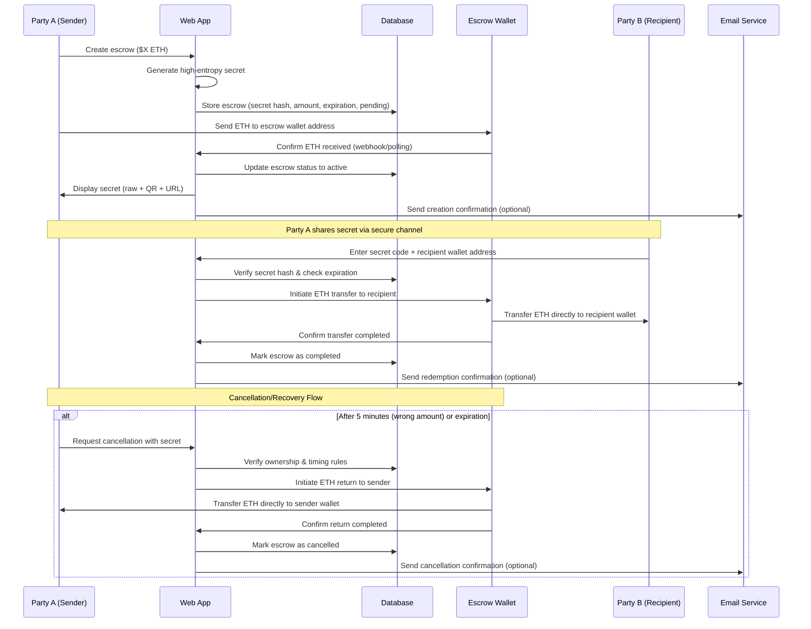

# 🎁 Coin Gift - Crypto Escrow Gift Application

A simple a## 🏗️ Technical Architecture

### Frontend
- **Framework**: React/Next.js
- **Deployment**: Github 
- **Wallet Integration**: Only for senders (MetaMask, Coinbase Wallet, etc.)
- **UI/UX**: Mobile-first responsive design

### Backend Service
- **API**: Node.js/Express or Python/FastAPI
- **Database**: PostgreSQL or MongoDB
- **Deployment**: Railway, Render, or AWS
- **Wallet Management**: Single secure escrow wallet

### Supporting Services
- **Email Service**: SendGrid or similar for notifications
- **Rate Limiting**: API-level protection against brute-force attacks
- **Monitoring**: Application and wallet monitoringi## 💡 Key Design Decisions

### Secret Generation
- **Format**: High-entropy random string (32+ characters)
- **Encoding**: Base64/Base58 for URL safety
- **Sharing**: Direct URL links and QR codes
- **Security**: Hashed in database, never stored in plaintext

### Economic Model
- **Escrow Limits**: $1 minimum, $1000 maximum (POC)
- **Transaction Fees**: Sender covers Base network fees
- **Operational Costs**: Covered by optional donations
- **Recovery**: Wrong amounts recoverable after 5 minutes

### Security Features
- **Wallet Security**: Multi-sig or hardware wallet for escrow funds
- **Rate Limiting**: API-level protection against brute-force attacks
- **Expiration**: Default 30-day expiration with sender recovery
- **Audit Trail**: Complete database logging for transparency
- **HTTPS**: Secure communication protocols
- **Data Encryption**: Sensitive data encrypted at resto friends and family. This application serves as a temporary escrow for crypto transactions, allowing users to send crypto gifts that recipients can claim using a secret code.

## 🎯 Overview

**Target Use Case**: Send crypto gifts for birthdays, holidays, or special occasions  
**Architecture**: Backend Service with Escrow Wallet  
**Supported Assets**: ETH on Base (POC)  
**License**: Open Source  

## ✨ Key Features

- 🔐 **Secure Escrow**: Backend service with dedicated escrow wallet
- 🎲 **High-Entropy Secrets**: URL/QR-shareable secret codes
- ⏰ **Configurable Expiration**: Default 30 days, sender recoverable
- 💰 **Amount Limits**: $1 - $1000 (POC)
- 📧 **Email Notifications**: Optional alerts for all parties
- 🚀 **Simple UX**: No wallet required for recipients
- 📱 **Mobile-Friendly**: QR codes and responsive design

## 🔄 Application Flow

## 🏗️ Technical Architecture

### Frontend
- **Framework**: React
- **Deployment**: Client-side static hosting
- **Wallet Integration**: EVM-compatible wallets (MetaMask, Coinbase Wallet, etc.)
- **UI/UX**: Mobile-first responsive design

### Smart Contract
- **Platform**: Base (EVM)
- **Design**: Factory pattern for escrow instances
- **Data Storage**: Minimal on-chain data (secret hash, amount, expiration, sender)
- **Gas Optimization**: Paymaster integration for gasless UX

### Backend Services
- **Architecture**: Serverless functions
- **Email Service**: Optional notification system
- **Rate Limiting**: Prevent brute-force attacks on secret verification

## 💡 Key Design Decisions

### Secret Generation
- **Format**: High-entropy random string (32+ characters)
- **Encoding**: Base58 for URL safety
- **Sharing**: Direct URL links and QR codes
- **Security**: Hashed on-chain, never stored in plaintext

### Economic Model
- **Escrow Limits**: $1 minimum, $1000 maximum (POC)
- **Gas Coverage**: Paymaster covers transaction fees
- **Donations**: Optional contributions to support the platform
- **Recovery**: Wrong amounts recoverable after 5 minutes

### Security Features
- **Rate Limiting**: Prevent brute-force secret attempts
- **Expiration**: Default 30-day expiration with sender recovery
- **Audit Trail**: Transaction logging for transparency
- **HTTPS**: Secure communication protocols

## 🚀 Implementation Phases

### Phase 1: Core MVP
- [ ] Backend API with database
- [ ] Escrow wallet setup and management
- [ ] React frontend with basic UI
- [ ] Secret generation and QR codes
- [ ] Basic create/redeem flow

### Phase 2: Enhanced UX
- [ ] Email notifications
- [ ] Mobile-responsive design
- [ ] Error handling and recovery
- [ ] Wallet integration for senders

### Phase 3: Production Ready
- [ ] Security hardening and wallet security
- [ ] Rate limiting and API protection
- [ ] Analytics and monitoring
- [ ] Documentation and deployment

### Phase 4: Future Enhancements
- [ ] Smart contract migration option
- [ ] Multi-token support
- [ ] Advanced features and integrations

## 🔒 Security Considerations

- **Secret Complexity**: High-entropy generation prevents brute-force attacks
- **Rate Limiting**: API-level protection against automated attacks
- **Wallet Security**: Multi-sig or hardware wallet for escrow funds
- **Database Security**: Encrypted sensitive data and secure access controls
- **Communication Security**: HTTPS for all data transmission
- **Audit Trail**: Complete database logging for transparency
- **Time-based Recovery**: Sender can recover funds after expiration or error correction period
- **Custodial Risk Mitigation**: Regular security audits and monitoring

## 📊 Scalability Considerations

**Initial Target**: ~100 escrows for POC testing  
**Architecture**: Traditional backend with horizontal scaling capability  
**Database**: Optimized for read/write patterns with proper indexing  
**Blockchain**: Base provides low fees and fast confirmations  
**Wallet Management**: Single escrow wallet can handle multiple concurrent transactions  
**Monitoring**: Track usage patterns, wallet balance, and system performance  

## 🔄 Migration Path to Decentralization

1. **Phase 1 (Current)**: Backend service for fast POC development
2. **Phase 2**: Optional smart contract integration for advanced users
3. **Phase 3**: Full decentralization with Paymaster when proven demand exists
4. **Phase 4**: Complete trustless operation

This approach allows rapid iteration and user validation while maintaining a clear path to full decentralization.